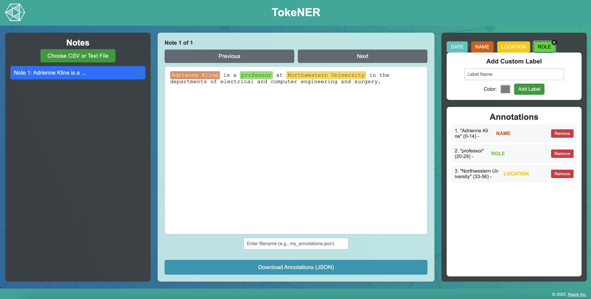

# TokeNER - Text Annotation Tool

A web-based Named Entity Recognition (NER) annotation tool for labeling and annotating text data for your local machine. TokeNER provides an intuitive interface for highlighting text segments and assigning custom labels, making it perfect for dataset preparation, NER training data creation, and text analysis. We've made this open source to handle the problem with PHI concerns to health-related data as well as foster tools for the open-soruce community!



## Citation

If you use TokeNER in your research or project, please cite it as:

```bibtex
@software{tokener2025,
  author = {Kline, Adrienne},
  title = {TokeNER: Text Annotation Tool for Named Entity Recognition},
  year = {2025},
  url = {https://github.com/adriennekline/tokener},
  note = {A web-based annotation tool for labeling and annotating text data}
}
```

## Features

### File Upload & Processing

- **Multiple Format Support**: Upload CSV or plain text files
- **Smart Text Parsing**: Automatically splits text by:
  - Paragraphs (double line breaks)
  - Sentences (for single paragraph files)
  - Lines (as fallback)
- **Markdown Cleaning**: Automatically removes markdown formatting including:
  - Headers (`#`, `##`, etc.)
  - Bold (`**text**`)
  - Italic (`*text*`)
  - Strikethrough (`~~text~~`)
  - Links and images
  - Blockquotes and code blocks

### Annotation Interface

- **Three-Panel Layout**:
  - **Left Sidebar**: Displays list of all notes/text segments
  - **Main Content Area**: Shows the current note with highlighted annotations
  - **Right Sidebar**: Annotation toolbar, custom label creation, and annotations list

### Text Annotation

- **Visual Highlighting**: Select text and assign labels with color-coded highlights
- **Smart Annotation Merging**: Automatically merges overlapping or adjacent annotations with the same label
- **Nested Annotation Support**: Handles overlapping annotations of different labels
- **Real-time Preview**: See annotations applied immediately on the text

### Label Management

- **Predefined Labels**: Three built-in label categories:
  - **Date** (Turquoise: `#4ecdc4`)
  - **Name** (Orange: `#de6312`)
  - **Location** (Yellow: `#ffcc00`)
- **Custom Labels**: Create unlimited custom labels with:
  - Custom name
  - Custom color picker
  - Remove option (x button)
- **Contrast-Aware Text**: Automatically adjusts text color (black/white) based on background color for optimal readability

### Navigation & Management

- **Note Navigation**:
  - Browse through notes sequentially with Previous/Next buttons
  - Click any note in the sidebar to jump directly
  - Visual indicator shows current note position (e.g., "Note 3 of 15")
- **Annotation Status**: Checkmark (✔) indicator shows which notes have been annotated
- **Active Note Highlighting**: Currently selected note is highlighted in blue

### Annotation List

- **Detailed View**: See all annotations for the current note with:
  - Annotation number
  - Selected text snippet
  - Character indices (start-end positions)
  - Label name (color-coded)
- **Quick Removal**: Remove individual annotations with a single click

### Export Functionality

- **JSON Export**: Download annotations in structured JSON format
- **Custom Filename**: Specify your own filename for the export
- **Filtered Export**: Only exports notes that have annotations (empty notes are excluded)
- **Data Structure**: Each export includes:
  - Original note text
  - Array of annotations with:
    - Label name
    - Color code
    - Start/end indices
    - Selected text

## Getting Started

### Installation

1. Download or clone the repository
2. No dependencies required - pure vanilla JavaScript
3. Open `tokener_together_logout.html` in a modern web browser

### Usage

#### 1. Upload a File

- Click the "Choose File" button in the left sidebar
- Select a CSV or TXT file from your computer
- The tool will automatically parse and display the text segments

#### 2. Navigate Through Notes

- Click any note in the left sidebar, or
- Use the Previous/Next navigation buttons

#### 3. Annotate Text

- Highlight text in the main display area
- Click a label button (Date, Name, Location, or custom label)
- The text will be highlighted with the label's color
- Annotation appears in the right sidebar list

#### 4. Create Custom Labels

- In the "Add Custom Label" section:
  - Enter a label name
  - Pick a color using the color selector
  - Click "Add Label"
- The new label appears in the toolbar and is ready to use

#### 5. Manage Annotations

- **Remove Individual Annotation**: Click "Remove" button next to any annotation in the list
- **Remove Custom Label**: Click the "x" button on any custom label in the toolbar

#### 6. Export Annotations

- Enter a filename in the input field (or use default "annotations.json")
- Click "Download Annotations" button
- A JSON file will be downloaded with all annotated notes

## File Format

### Input Files

**CSV Format:**

```csv
First note text here
Second note text here
Third note text here
```

**Text Format:**

```text
First paragraph or sentence.

Second paragraph or sentence.

Third paragraph or sentence.
```

### Output JSON Format

```json
{
  "annotations": [
    {
      "note": "John Smith visited New York on January 15, 2024.",
      "annotations": [
        {
          "label": "Name",
          "color": "#de6312",
          "start_idx": 0,
          "end_idx": 10,
          "text": "John Smith"
        },
        {
          "label": "Location",
          "color": "#ffcc00",
          "start_idx": 20,
          "end_idx": 28,
          "text": "New York"
        },
        {
          "label": "Date",
          "color": "#4ecdc4",
          "start_idx": 32,
          "end_idx": 48,
          "text": "January 15, 2024"
        }
      ]
    }
  ]
}
```

## Technical Details

### Browser Compatibility

- Modern browsers with ES6 support
- HTML5 File API
- CSS3 for styling

### Key Technologies

- Pure vanilla JavaScript (no frameworks)
- HTML5 Canvas and File Reader API
- CSS3 Flexbox layout
- Responsive design

### Data Structures

- **Notes Array**: Stores cleaned text segments
- **Original Notes Array**: Preserves original text with markdown
- **Annotations Object**: Keyed by note index, contains arrays of annotation objects
- **Custom Labels Object**: Stores user-defined label names and colors

## Features in Detail

### Smart Annotation Merging

When you select overlapping or adjacent text with the same label, TokeNER automatically merges them into a single annotation. This prevents fragmented annotations and keeps your data clean.

### Character-Level Precision

All annotations store exact character indices (start_idx, end_idx), allowing for:

- Precise text reconstruction
- Easy integration with NLP pipelines
- Accurate training data for ML models

### Visual Feedback

- Active note highlighted in blue
- Annotated notes marked with green checkmark (✔)
- Color-coded highlights in text display
- Hover tooltips show label names

## Use Cases

- **NER Dataset Creation**: Prepare training data for Named Entity Recognition models
- **Text Analysis**: Manually label and categorize text segments
- **Document Review**: Highlight and categorize important information in documents
- **Research**: Annotate text corpora for linguistic or content analysis
- **Data Labeling**: Create labeled datasets for machine learning projects

## Tips & Best Practices

1. **Label Consistently**: Use the same label names for similar entities across all notes
2. **Review Before Export**: Check the annotations list to ensure accuracy
3. **Use Custom Labels**: Create labels specific to your domain (e.g., "Product", "Company", "Price")
4. **Save Regularly**: Download annotations periodically to avoid data loss
5. **Name Your Files**: Use descriptive filenames when exporting (e.g., "medical_terms_2024.json")

## Credits

© 2025 [Xtasis Inc.](https://xtasis.com)

## License

All rights reserved.
